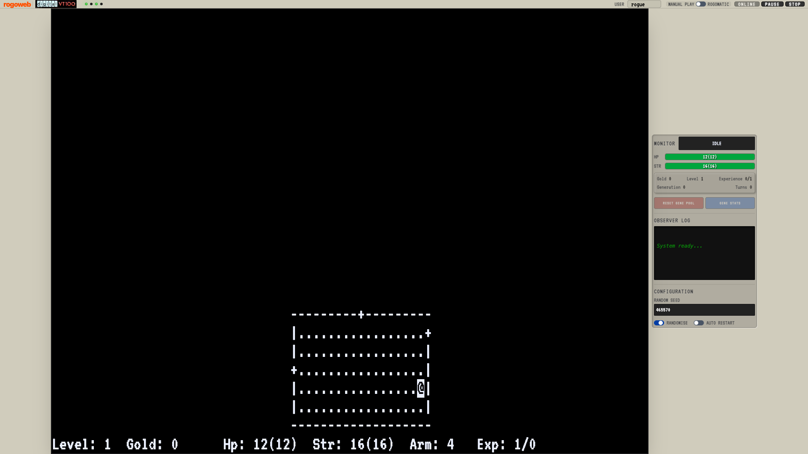

# Rogoweb

**Rogoweb** is a modern, web-based port of the classic 1980 dungeon crawler **Rogue** and its legendary automated player, **Rog-O-Matic**. 

This project unites these two historic C codebases into a single repository, compiling them to WebAssembly (WASM) and running them entirely in the browser. It features a rich VT100-style terminal interface and live, high-fidelity telemetry.



---

## 📜 Origin and History

This repository was created by merging the original C source codes of:
*   **Rogue 5.4**: The definitive version of the foundational roguelike game, originally created by Michael Toy, Glenn Wichman, and Ken Arnold.
*   **Rog-O-Matic XIV**: The famous expert system created in 1981 by Michael Mauldin, Guy Jacobson, Andrew Appel, and Leonard Hamey at Carnegie Mellon University to autonomously play and beat Rogue.

### The Porting Process
Historically, Rog-O-Matic ran as a separate Unix process, playing Rogue by spawning it as a child process and communicating with it via standard `stdin`/`stdout` pipes. 

To bring this architecture to the web, we undertook the following engineering steps:
1.  **Consolidation**: Both codebases and a custom terminal emulation layer (`emcurses`) were brought into a single standalone repository.
2.  **WebAssembly Compilation**: We modified the `Makefile` and `Autotools` configurations to compile the C code using **Emscripten** (`emcc`).
3.  **Virtual IPC (Inter-Process Communication)**: Because browsers do not have traditional OS pipes or `fork()`/`exec()`, we replaced the standard `read()` and `write()` calls in the C code with custom `wasm_pipe_read()` and `wasm_pipe_write()` hooks.
4.  **Dual Worker Architecture**: Rogue and Rog-O-Matic run in separate, dedicated **Web Workers**. They communicate synchronously via a `SharedArrayBuffer` implementing a thread-safe ring buffer, perfectly mimicking the original Unix pipe behavior without blocking the browser's main UI thread.
5.  **High-Fidelity Telemetry**: Instead of scraping the terminal screen for stats (which causes overhead and parsing errors), the C code was modified to write internal engine state (HP, Gold, Level, AI Intent) directly into a dedicated region of the `SharedArrayBuffer`. The React-style UI passively polls this memory, providing real-time stats with zero performance overhead.

---

## 🎮 UI & Dashboard Guide

Rogoweb features a high-fidelity dashboard inspired by the **DEC VT100** terminal. The interface is split between the live terminal and a telemetry sidepanel.

### 1. Operator Panel (Top Bar)

Located at the top of the workspace, this panel controls the simulation state.

*   **Status Lights (LEDs)**:
    *   **L1 (Green)**: **GAME ACTIVE** – Lit when the Rogue game process is running in its worker.
    *   **L2 (Green)**: **AI ACTIVE** – Lit specifically when Rog-O-Matic has control of the input stream.
    *   **L3 (Green)**: **SYSTEM READY** – Indicates the simulation environment and SharedArrayBuffer are healthy.
    *   **L4 (Amber)**: **STANDBY/LOAD** – Lights up during initialization or background filesystem synchronization.
*   **User Input**: Set the Unix-style username for the session (affects high scores and save files).
*   **Mode Toggle**:
    *   **MANUAL PLAY**: You have full keyboard control over the terminal.
    *   **ROGOMATIC**: Hand over control to the AI.
*   **Control Buttons**:
    *   **START**: Launches the game processes.
    *   **PAUSE**: Freezes the simulation (useful for inspecting a difficult dungeon floor).
    *   **STOP**: Terminates the session and resets the workspace.

### 2. Telemetry Dashboard (Side Panel)

This panel provides a live "heartbeat" of the internal engine state without interrupting the terminal display.

*   **Monitor Stats**:
    *   **BOT STATE**: Displays the current AI intent (e.g., IDLE, RUNNING, EXPLORING, HEALING).
    *   **HP (Hit Points)**: A real-time health bar. It turns **Red** when critical (<30%) and **Amber** when wounded (<70%).
    *   **Dungeon Readouts**: Live values for Strength, Gold, Level, and Experience.
    *   **Generation**: In Rog-O-Matic mode, shows which "Generation" from the genetic algorithm is currently playing.
    *   **Turns**: Cumulative count of game turns processed.
*   **Gene Management**:
    *   **RESET GENE POOL**: Opens a dialog to re-initialize the genetic population. You can set the population size and an initial seed for evolution.
    *   **GENE STATS**: Displays detailed fitness data from the `GenePool544` file, showing which "genes" (strategy parameters) are performing best.
*   **Observer Log**: A diagnostic stream showing low-level system events, filesystem syncs, and worker status messages.
*   **Configuration**:
    *   **Random Seed**: Lock the game to a specific seed for reproducible "speedruns" or debugging.
    *   **Randomise Toggle**: When active, every new game will generate a fresh random seed.
    *   **Auto Restart**: Perfect for "headless" training; the system will automatically launch a new game 5 seconds after the previous one ends.

---

## 🏗️ Architecture

*   **`rogue/`**: The Rogue 5.4 C source code. Modified with `#ifdef ROGOWEB` blocks to support WASM IPC and stat reporting.
*   **`rogomatic/`**: The Rog-O-Matic XIV C source code. Adapted to communicate via virtual WASM pipes instead of OS-level pipes.
*   **`emcurses/`**: A custom implementation of `curses` designed for Emscripten, hooking into our VT100 frontend.
*   **`src/`**: The modern frontend built with **TypeScript**, **Vite**, **Tailwind CSS**, and **xterm.js**.
    *   `src/rogue-worker.ts` & `src/rogomatic-worker.ts`: Web Workers hosting the WASM instances.
    *   `src/ipc/ring-buffer.ts`: The `SharedArrayBuffer` implementation handling inter-worker pipes and shared stat memory.

---

## 🚀 How to Build and Run

### Prerequisites

To build this project, you need both modern web tools and C compilation tools:
1.  **Node.js** (v18 or higher) and `npm`.
2.  **Emscripten** (`emsdk`): The WASM compiler toolchain. **Fully activate it** with `source /path/to/emsdk/emsdk_env.sh` before building — just putting `emcc` on `$PATH` is *not* enough (see the ⚠️ note under *Setup & Compilation*).
3.  **Standard Build Tools**: `make`, `autoconf`, `automake` (required to compile the legacy C codebases).

### Setup & Compilation

1.  **Install JS Dependencies:**
    ```bash
    npm install
    ```

2.  **Compile the C code to WebAssembly:**
    This step runs `emmake` and compiles `emcurses`, `rogue`, and `rogomatic` into `.js` and `.wasm` files located in `public/wasm/`.
    ```bash
    source /path/to/emsdk/emsdk_env.sh   # activate emsdk in THIS shell first
    npm run build:wasm
    ```

    > ⚠️ **WASM build gotcha.** The wasm **must** be built with the emsdk fully
    > activated (`emsdk_env.sh` sets `EMSDK_NODE`, `EM_CONFIG`, and the compiler
    > cache), not merely with `emcc` on `$PATH`. An incomplete activation
    > produces a binary that *links fine* but has broken **ASYNCIFY**, which
    > then hangs at the very first async IDBFS sync — the game prints
    > `Rogomatic: Genes written, triggering sync...` and never starts. If a
    > freshly-rebuilt wasm hangs there, this is almost always the cause.

3.  **Run the Development Server:**
    ```bash
    npm run dev
    ```
    Open the provided `localhost` URL in your browser. 
    
    *Note: The development server is configured with `Cross-Origin-Opener-Policy` and `Cross-Origin-Embedder-Policy` headers, which are strictly required by browsers to enable `SharedArrayBuffer`.*

### Building for Production

To create a static production build:
```bash
npm run build
```
The compiled files will be output to the `dist/` directory.

#### Hosting Notes (GitHub Pages)
Because this application relies on `SharedArrayBuffer`, your production web server **must** send cross-origin isolation headers. If you are deploying to a static host that doesn't allow custom headers (like GitHub Pages), this repository includes `coi-serviceworker`, which intercepts requests client-side to enforce the necessary isolation policies automatically.

---

## 🎮 Playing the Game

When you load the app, you will see the VT100 terminal interface and the telemetry dashboard.

*   **MANUAL PLAY**: You take control. Type commands directly into the terminal to play Rogue.
*   **ROGOMATIC (AUTO)**: Click "START" and watch as the legendary AI takes over, playing the game at blazing speeds while broadcasting its internal thoughts and statistics to the dashboard.

---

## 🧬 Pretraining the Gene Pool (headless)

Rog-O-Matic *learns* across games: a genetic pool of "knob" settings (search / rest / attack
tendencies) plus a long-term monster-danger memory, persisted in the browser's IndexedDB. A
brand-new browser starts from a **random** pool and plays poorly until it has evolved one.

To give new users a head start, the pool can be **pretrained offline** and bundled with the app.
`npm run pretrain` plays games back-to-back in a headless browser (real WASM, no UI) and writes
the evolved pool to `public/wasm/GenePool544.pretrained`. On a fresh browser the rogomatic worker
seeds IndexedDB from that file (see *Robustness* below), so the very first game already runs on a
trained pool.

Each run **resumes from and evolves the bundled pool** (the default `--out` *is* that file), so
running `npm run pretrain` repeatedly keeps strengthening the shipped pool. Use `--reset` to throw
it away and start from a fresh random pool.

It trains **in parallel across all CPU cores by default**: N isolated "islands" (Playwright browser
contexts, each with its own IndexedDB) evolve their own copy of the pool at once, then the driver
merges them into one. Each game-pair is mostly blocked on `Atomics.wait` (~1 core), so this scales
near-linearly — measured **~10× on a 10-core machine**. Set `--jobs=1` for serial.

```bash
npm run pretrain                                # all cores in parallel, building on the pool
npm run pretrain -- --jobs=4 --runs=200         # 4 islands × 50 games each, then merge
npm run pretrain -- --reset --runs=100          # start over from a fresh random pool
npm run pretrain -- --jobs=1                     # serial (one island, no merge)
```

| Flag | Default | Meaning |
|------|---------|---------|
| `--runs=N` | 100 | total games, split evenly across `--jobs` islands (≈5× the 20-genotype pool — see below) |
| `--jobs=N` | cpu count | parallel islands (isolated pools) merged at the end; `1` = serial, no merge |
| `--until=<metric><op><value>` | — | stop early when an island's pool hits a goal, e.g. `meanLevel>=4`, `highScore>1000`, `trialno>=200` |
| `--timeout=<ms>` | 45000 | per-game wall-clock cap; a stuck genotype is killed and skipped |
| `--seed=random\|<n>`, `--base=<n>` | random | deterministic seeds for reproducible batches |
| `--out=<file>` | `public/wasm/GenePool544.pretrained` | where to write the evolved pool (defaults to the bundled pool, so runs accumulate) |
| `--reset` | off | wipe the pool and start from a fresh random one instead of resuming |

**How it works.** `scripts/pretrain.mjs` starts one Vite dev server (COOP/COEP headers for
`SharedArrayBuffer`), launches one headless Chromium (`playwright-core`), and opens `--jobs`
**isolated browser contexts**. Each loads `pretrain.html` (`src/pretrain/harness.ts`), which spawns
the *same* rogue + rogomatic workers the app uses and evolves its own pool in IDBFS — the islands
never contend on the shared pool because each context has its own IndexedDB. The driver then
extracts every island's `GenePool544` and **merges** them: it pools each genotype's fitness across
islands (subtracting the shared resume-base so its games aren't counted once per island). The merge
is **elitist / no-regression** — it keeps the pool at its existing size (20), a genotype is only
ever replaced by a *robustly* better one (fitness is weighted by evidence, so a lucky low-sample
genotype can't evict a proven one), and the peak score/level never drop below the base's. On top of
that the driver **only overwrites the pool if the run improved it** — reached a new peak, or held
the peak with an equal-or-better mean; a bad or unlucky run leaves the existing pool untouched. Every
run therefore refines and improves the pool without discarding what it already learned. Needs a
cached Chromium — `npx playwright install chromium`, or point `CHROMIUM_EXE` at an existing binary. Genotypes are self-contained (`dna[8]` + stats; parents are logging-only in
`learn.c`), which is what makes a clean merge possible.

**Why 100 runs?** The pool holds **20 genotypes** (`learn.c`, max 100). `pickgenotype()` tests
*every* genotype to a minimum-trial threshold before it begins breeding (crossover/mutate), so real
evolution only starts once the whole initial pool is evaluated. At the ~⅓ natural-death record
rate, ~100 games yields enough recorded trials to evaluate all 20 initial genotypes and breed the
first evolved generation. It's lifetime-learning with no fixed convergence (the `untested()`
threshold grows with total trials), so more games keep helping with diminishing returns — 100 is
the practical knee for a shipped starter pool.

> Bootstrap games are shallow (an untrained bot usually dies on levels 1–3), so a modest batch
> already culls the worst genotypes; because runs accumulate, just run `npm run pretrain` a few
> more times (or one big `--runs=300+` detached batch) to keep strengthening the pool. The bundled
> pool was built this way: a `--reset` batch of 40 games, then resume runs that filled coverage to
> all 20 genotypes and bred the first crossover generation.
> Because deeper-game tactics (dragon handling, the Amulet ascent) never trigger at those depths,
> they aren't exercised by pretraining — they're validated by source review and real deep play.
>
> Only a game that ends **naturally** (the bot dies) records a genotype's fitness; a genotype that
> gets the bot stuck searching a level times out and records nothing, so it can't be culled — set
> `--timeout` high enough that real games finish (too low guillotines good games before they score).

---

## 📸 Screenshots & social preview

Two npm scripts drive the **real app** headlessly (the same `playwright-core` + Chromium setup as
pretraining) to capture promo imagery mid-game at a decent depth — no manual play required:

```bash
npm run screenshot     # full 1920×1080 app screenshot → public/screenshot.png (+ ./screenshot.png)
npm run og-image       # 1200×630 social card          → public/og-image.png   (+ ./og-image.png)
```

Both run Rog-O-Matic (auto-restarting across deaths) until a game reaches a target dungeon level,
wait for that level to be actually **explored** (map revealed, not a fresh dark arrival — a settle
heuristic keeps the *deepest* explored view), then screenshot. Flags: `--target=N` (dungeon level
to reach), `--width`/`--height` (viewport), `--settle=<s>` (seconds on a level before it counts as
explored), `--timeout=<ms>` (per-run cap), `--seed=<n>`, `--out=<file>`.

`og-image` captures **directly at 1200×630** — the Open Graph / Twitter `summary_large_image`
optimum (1.91:1) — so the responsive UI lays itself out to fit at that size and **nothing is
cropped**. `index.html`'s `og:image` / `twitter:image` point at `og-image.png`, and the bundled
`screenshot.png` currently holds that same level-5 capture; run `npm run screenshot` to regenerate
a full-resolution 1920×1080 version for the README / repository preview. Needs a cached Chromium
(`npx playwright install chromium`, or point `CHROMIUM_EXE` at an existing binary).

---

## 🧪 Testing

```bash
npm test          # unit suite (vitest; node + jsdom) — fast, no browser
npm run test:e2e  # end-to-end (Playwright): boots a dev server + headless Chromium
npm run test:all  # both
```

**Unit tests** (`src/**/*.spec.ts`, `scripts/**/*.spec.ts`) cover the pure logic: the
`SharedArrayBuffer` ring buffer and WASM-pipe IPC, the terminal shim, responsive scaling / layout,
the v1.0.0 telemetry helpers (`src/telemetry.ts` — descent milestones, the latched low-HP warning,
gene-pool-size parsing, the game-over summary, version/commit formatting), the SEO / Open Graph
tags and status-panel scaffolding (JSDOM over `index.html`), the gene-pool **merge invariants**
(`scripts/genepool.mjs` — base-subtract accounting, evidence-weighted elitism, no-regression /
ratchet), and version-agnostic Chromium detection (`scripts/chromium.mjs`).

**End-to-end tests** (`e2e/**/*.e2e.ts`) drive the *real* app in headless Chromium: they assert
cross-origin isolation (so `SharedArrayBuffer` is available), the 1200×630 og:image, the
version/commit footer, that START enables once the runtime is ready, and — playing Rog-O-Matic back
to back — that live telemetry (turns, gene-pool size) and the descent milestones update, with no
debug output leaking into the status panel. They **skip automatically** when no cached Chromium is
present, so `npm test` stays green on a bare checkout.

---

## 🔧 Enhancements in This Fork

Rog-O-Matic was originally written for older Rogue variants and carries multi-version
support (`RV36`/`RV52`/`RV53`/`RV54A`); it detects this build as **RV54A — Rogue 5.4.4**.
An audit confirmed its version *branching* is sound (5.4.4 takes the correct modern branch
everywhere), so the work below is about **correct behaviour within that branch**, several
**latent bug fixes**, **smarter play**, and **hardening the web port**. All C changes are
under `rogomatic/src/`; frontend changes under `src/`.

### Rogue 5.4.4 ↔ Rog-O-Matic compatibility fixes

Places where Rog-O-Matic mis-handled 5.4.4 because it targeted older Rogue:

*   **Ring of *increase damage* now applies its bonus** (`arms.c`). `setbonuses()` tested for a ring named *"add damage"*, but 5.4.4's ring is *"increase damage"* — so the ring was worn/valued but its damage bonus was silently dropped from combat math. (`ringclass()` already used the correct name; this completed the rename.)
*   **Wands of lightning / fire / cold are identified from combat** (`mess.c`). Rogue prints *"the bolt/flame/ice …"* when you zap these; those messages were swallowed as no-ops, so the wands could never be auto-identified. They now infer the wand (`lightning`/`fire`/`cold`) from the just-zapped item — while still distinguishing the real *ice monster* from the *"ice"* projectile.
*   **Mystery trap (`T_MYST`) is no longer over-avoided** (`mess.c`). 5.4.4 adds an 8th, **purely cosmetic** trap (in `rogue/move.c` it only prints one of 11 flavour messages). Rog-O-Matic tagged all of them as a **bear trap**, which made its pathfinder treat that square as *unreachable* (`safevalue → ROGINFINITY`) — denying rest and routing every game one appeared. The messages are now recognised without the bear-trap tag; the revealed `^` still gives appropriate mild avoidance.
*   **Damage-bonus table corrected** (`arms.c`). `damagebonus()` had an unreachable `else if (strength < 1600)` branch, so Strength 22–30 returned **+6** instead of the correct **+5** (per Rogue's `add_dam[]` in `fight.c`), over-estimating the hero's own melee damage. The ladder now matches Rogue exactly.
*   **Rust-trap flag is now cleared** (`rooms.c`). The `WATERAP` bit was *set* by `nametrap` but omitted from every reset mask, so a stale rust-trap bit could persist on a re-used square and skew teleport-trap inference. Added to all `unsetrc` masks.
*   **Unseen-monster gaze confusion detected** (`mess.c`). An *unseen* confuser makes Rogue print *"its gaze has confused you"* (not *"the …'s gaze …"*), which was missed; now handled.
*   **Emergency-eat trigger matched to 5.4.4** (`mess.c`). The only eat-triggering hunger pattern, *"you are weak from hunger"*, is never emitted by 5.4.4; the real terse warning *"you are starting to feel weak"* now calls `eat()`.
*   **Scoreboard reader fixed** (`findscore.c`). It scanned for a `"Rank"` header; 5.4.4 prints `"   Score Name"`. Header detection now accepts either (native builds only — not compiled into the wasm binary).

### AI / gameplay improvements (plays better)

> ⚠️ These are combat/economy **heuristics**. Each is individually reasoned and source-verified, but the *real* measure is win-rate / average depth over **many** games (the gene pool records exactly this). Treat them as directional and validate by batch play.

*   **Per-monster danger model** (`ltm.c`) — *the highest-impact change.* `analyzeltm()` previously rated every un-observed monster's damage as a flat `7 + dungeon-level`, so a dragon on level 10 was estimated at **17 max** vs. its real **46** — and fight-vs-flee runs on that number. It now **seeds each monster from a static 5.4.4 damage table** (average + max per round, computed from the damage dice in `rogue/extern.c`), refined by long-term memory, floored at the true theoretical max so worst-case danger is never under-estimated. Rogue does *not* scale monster damage with depth (`new_monster` copies `s_dmg` unchanged), so a fixed table is correct. This also fixed a latent bug where an un-observed monster inherited the *previous* monster's numbers (the estimate variables were initialised once, outside the loop).
*   **Food-aware descent pacing** (`strategy.c`) — the pre-descent "grub around for secret doors" step ran on every level with *any* food, so the bot over-explored and starved. It now grubs only with a real food margin (`havefood(2)`); when food is tight it dives for the stairs (a fresh level is a better food source), while the fallback searches still find the stairs when none are reachable.
*   **Emergency heal when adjacent** (`strategy.c`) — the healing rule required the monster to be *non-adjacent* (`turns > 0`), skipping the most lethal case. It now drinks healing at `die_in(1)` even when the monster is adjacent (healing potions also raise max HP, so they're rarely wasted).
*   **Teleport a *ranged* dragon** (`strategy.c`) — teleport-away only fired on *adjacent* monsters, but the dragon flames from range for ~46 and the bot (rightly) won't flee it, so it tanked flame until the dragon closed. It now teleports a dragon at range when `die_in(1)`.
*   **Quaff-ID safety** (`tactics.c`) — unknown potions are blind-quaffed only when nothing is nearby (`mlistlen == 0`), so a confusion/blindness/poison roll can't be punished by an adjacent monster (matching `trywand()`).
*   **Missile economy** (`arms.c`) — `havemissile()` no longer offers a spare mace/long-sword as ammo; because it picks the *fewest-count* candidate, a count-1 backup weapon was thrown ahead of a whole stack of arrows. It now throws only real throwables (arrows/spears/daggers).
*   **Amulet-return economy** (`strategy.c`) — while carrying the Amulet of Yendor, gold is excluded from item targeting so the bot doesn't detour for gold on the deadly ascent (gold can't change a win); useful items are still collected.

### Robustness (web port)

*   **Gene-pool self-healing** (`src/rogomatic-worker.ts`) — a corrupt/truncated `GenePool544` (e.g. from an interrupted IDBFS sync) made the C learner index garbage genotypes and **hang on startup** (the "game won't start" symptom, stuck at `Genes written, triggering sync...`). The worker now validates the pool before `callMain()` and deletes a bad one so a fresh pool is created rather than hanging. Verified end-to-end (corrupting the IndexedDB record triggers an automatic reset, then the bot plays).
*   **Pretrained gene pool: seed & auto-upgrade** (`src/rogomatic-worker.ts`) — before `callMain()` the worker reconciles the persisted `GenePool544` against the bundled `public/wasm/GenePool544.pretrained`: (a) *no pool yet* (new user / cleared storage) → **seed** it, so the first game runs on a trained pool; (b) *a pool carried over from an older app version that is **shallower*** (lower max depth, then max score, from the pool header) → **silently upgrade** it, so returning players aren't stuck with a weaker pool. A deliberate reset is respected: the worker records which bundled pool it has applied (`pretrained_ver`) and only re-checks when a *newer* bundled pool ships, so a freshly-reset pool is left alone. Skipped during headless pretraining. See *[Pretraining the Gene Pool](#-pretraining-the-gene-pool-headless)* above; verified headlessly across all three cases (seed / upgrade-shallow / skip-after-reset).

### Build / frontend / tooling

*   **Production build fixed** (`src/main.ts`) — removed a dead `CanvasAddon` import that failed `tsc` under `noUnusedLocals`.
*   **COI service-worker path** (`index.html`) — `coi-serviceworker.min.js` → `/coi-serviceworker.min.js`, so Vite treats it as a public asset (silences a bundling warning; the `/rogoweb/` base is applied automatically).
*   **Lint clean** (`eslint.config.js` + `src/`) — ignore the vendored `emcurses/`, fix worker ambient declarations, `prefer-const`, unused vars and empty `catch` blocks; `npm run lint` passes.
*   **WASM build gotcha documented** — see the ⚠️ note under *Setup & Compilation* (emsdk must be fully activated, or ASYNCIFY breaks and the game hangs at first sync).

---

## 🗺️ Roadmap — What's Left

The clearly-safe, high-value improvements are done. The remaining items are deliberately
**not implemented** — they are either *risky* (could make the AI play worse and need
validation over many games) or *low-value*. **Validate any of these by win-rate / average
depth across a batch of games, not a single run.**

### Risky (need careful design + batch testing)

1.  **Kite awake monsters with missiles** (`explore.c`, `archmonster`) — archery repositioning only targets *sleeping* monsters; setting up shots on awake, approaching monsters (kiting) is strong in Rogue but risks manoeuvring into a worse position.
2.  **Proactive escape / polymorph** (`strategy.c`, `battlestations`) — use teleport-away/polymorph on bad matchups *before* `die_in`. Trades limited, precious wand charges for damage avoidance (and polymorph is random — can backfire).
3.  **Multi-monster adjacency counting** (`strategy.c`, `fightmonster`) — the `adjacent` counter is gated on `CANGO` (whether *we* could move there), so a diagonal attacker through a doorway can be under-counted, weakening the "retreat to a chokepoint when ganged" logic.
4.  **Genetic parent selection** (`learn.c`, `selectgene`) — parents are weighted by `score.high` (one lucky game) with the mean-based version commented out; selecting by mean / an upper-confidence bound would learn more robustly but changes evolutionary dynamics.
5.  **Pathfinding "long way around" bug** (`strategy.c`, author-flagged) — the bot "sometimes goes the long way around and doesn't see things." A genuine defect, but central movement code.

### Low-value

6.  **Proactive monster-detection potion** — quaff monster detection on entering deep levels for map awareness (rare item, situational).
7.  **Aquator-armor priority** — take off rustable armor sooner vs. an aquator (marginal; aquators do 0 HP damage in 5.4.4).
8.  **Dead-code cleanup** — remove inert legacy branches (genocide scroll, phantom items, old monster names). Harmless; cosmetic only.

---

## 📐 Implementation Plan for the Risky Items (design only — not executed)

For each risky item: **problem → approach → risk → how to validate.** None of these are
implemented; this is a design guide for whoever picks them up. The already-landed
**per-monster danger model** is a prerequisite for #2 (it makes `maxhit`/matchup estimates
trustworthy).

### 1. Kiting awake monsters — `explore.c` `archmonster()`
*   **Problem:** `archmonster()` bails on `if (mlist[m].q != ASLEEP) return 0`, so the bot never manoeuvres to fire on an awake monster; it only throws at ones already in a straight line.
*   **Approach:** Allow repositioning against *awake* monsters only when safe — gate on `mdist >= 2 && live_for(2)` and a worthwhile arch target (dangerous, or one you shouldn't melee). Re-use `archeryinit`/`archeryvalue`, but add a bias to the move evaluator that **never decreases** distance to the monster (retreat-while-firing), not close it.
*   **Risk:** The positioning math assumes a stationary sleeper; an awake monster closes while you move, so a naive change can reduce distance and get you hit, or make the bot dither (reposition without firing).
*   **Validate:** Batch games weighted to rattlesnake/centaur/wraith encounters; compare arrows-per-kill and HP-lost-per-encounter vs. baseline, and check the bot still fires (no dithering loop).

### 2. Proactive escape / polymorph — `strategy.c` `battlestations()`
*   **Problem:** Escape wands fire only at `die_in(n)` — often too late against burst monsters (dragon, jabberwock, black unicorn).
*   **Approach:** Add an "unfavourable matchup" trigger *before* `die_in`: fire teleport-away when the monster's `maxhit` is a large fraction of `Hpmax` **and** the hits-to-kill vs. hits-to-die trade is unfavourable **and** we hold a non-`WORTHLESS` teleport-away. Keep **polymorph out** of the proactive path (random outcome). Cap to ~once per monster to conserve charges.
*   **Risk:** Depletes limited charges; too-eager thresholds waste wands on winnable fights and leave the bot worse off.
*   **Validate:** Track teleport-away charges/game and deaths-to-burst-monsters; the change should cut the latter without a big rise in "teleported an easy monster." A/B on identical seeds.

### 3. Multi-monster adjacency counting — `strategy.c` `fightmonster()`
*   **Problem:** A monster increments `adjacent` only when the orthogonal squares between it and the hero are `CANGO`; but 5.4.4 monsters attack diagonally, so a diagonal attacker through a wall gap adds to `danger` yet not `adjacent`, under-firing the `adj > 1` chokepoint retreat (`backtodoor`).
*   **Approach:** Count a monster toward `adjacent` when it can actually attack — Chebyshev distance 1 to the hero — independent of whether the hero could step onto its square. Keep the `CANGO` test only for "can I move to hit it."
*   **Risk:** `adjacent` feeds several fight/flee decisions; higher counts could make the bot retreat too eagerly in the open.
*   **Validate:** Compare survival in corridor/doorway gang-ups vs. over-retreating in open rooms.

### 4. Genetic parent selection — `learn.c` `selectgene()`
*   **Problem:** Parents are weighted by `genes[g]->score.high` (best single game), biasing evolution toward lucky outliers in a very high-variance game.
*   **Approach:** Weight by the **mean** score (the commented-out alternative is already there) or an **upper-confidence bound** `mean + c·stdev/√trials` to retain exploration; consider raising the minimum trials before a genotype influences selection so estimates are less noisy. The death-selector `badgene()` already uses a sound lower-confidence bound, so this aligns the two ends.
*   **Risk:** Alters long-term learning dynamics; effects appear only over many generations — hardest to validate, easiest to get subtly wrong.
*   **Validate:** Long unattended runs (Auto-Restart) with a fixed pool seed; compare pool mean-score/mean-level trajectories over hundreds of trials, baseline vs. change.

### 5. Pathfinding "long way around" — `strategy.c`
*   **Problem:** Author-flagged: the bot sometimes takes a needlessly long route and misses things it should see.
*   **Approach:** First reproduce (record a seed where it happens), then trace target/goal selection (`gotowardsgoal`, `findroom`, and the `makemove` value functions) to find where the cost/target is chosen sub-optimally — likely a targeted fix to a value function, not a rewrite.
*   **Risk:** Movement is central; a wrong change can strand the bot or cause loops. Highest-touch item in the set.
*   **Validate:** Reproduce on the recorded seed, confirm the specific detour is gone, and check a batch for new loops/strandings.

---

## ⚖️ License

The original Rogue and Rog-O-Matic codebases are distributed under their respective historical licenses (see `rogue/LICENSE.TXT` and `rogomatic/COPYING`). 

The web frontend, WASM bridge, and IPC tooling are provided as part of this modern port.
